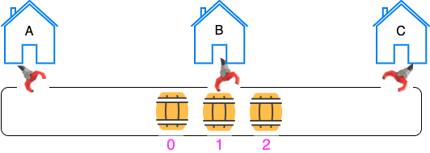

# CS 2910 - Assignment 2 - Rum Running Inventory

## Assignment 2: Due Date - October 30 11:59pm

PEI and Charlottetown have a long history of rum-running (see for example: [Rum-Running](https://www.cbc.ca/news/canada/prince-edward-island/pei-bygone-days-rum-running-1.4839501)

Some of the houses in Charlottetown are known to have tunnels underneath them which were used to move illegal liquor during PEI's prohibition days. The tunnels could be used to transport barrels or rum (or even as an escape tunnel in case the authorities raided a particular residence).

In one Charlottetown neighbourhood there exists an elaborate underground tunnel that connects 3 houses (labelled A,B and C) in a straight-line.



Each of the houses has a grabber arm that is capable of placing a barrel into the tunnel or removing a barrel. However the grabber arm is only capable of grabbing the closest barrel or placing a new barrel into the closest spot to the grabber arm (pushing the other barrels out of the way).

Each of the families in the 3 houses are involved in the lucrative rum trade and they will place barrels with various amounts of rum into the tunnel and take barrels with various amounts of rum out of the tunnel, in the end they split their profits. The families however, do not trust the other families. They would like you to build an inventory system for them to keep track of their barrels of rum.

From left to right the barrels in the tunnel should be labelled 0 through N.

The rules for where houses can access barrels in the tunnel:

1. House A can add barrels into position 0 of the tunnel and remove barrels from position 0.

2. House B can add barrels into position N/2, where N is the number of barrels in the tunnel (after the insert is complete) and remove barrels from position N/2 (where N is the number of barrels in the tunnel before removing the barrel). Here /2 is integer division. E.g. if there are 3 barrels in the tunnel then house B can add a barrel into the tunnel and that barrel would be found at index position 4/2 = 2 after the add is complete. If there are 3 barrels in the tunnel and house B wants to remove a barrel they would remove the barrel in index position (3/2 = 1) leaving just two barrels left.

3. House C can add barrels into position N of the tunnel and remove barrels from position N of the tunnel.

All of the barrels have between 0 and 100 litres in them which must be accounted for.

The houses are very far apart and so the tunnel can hold up to 1 billion barrels of rum.

You are required to implement the following interface:

```java

public interface Tunnel extends Iterable<Integer>{

/**
Add a barrel with amtOfRum to the tunnel from House A
This method runs in O(1) time
@param amtOfRum the amount of rum in this barrel
**/
public void addA(int amtOfRum);

/**
Remove a barrel from the tunnel through House A
This method runs in O(1) time
throws NoSuchElement exception if the tunnel is empty
@return the amount of rum in the barrel that is removed
**/
public int removeA();

/**
Add a barrel with amtOfRum to the tunnel from House B
This method runs in O(1) time
@param amtOfRum the amount of rum in this barrel
**/
public void addB(int amtOfRum);

/**
Remove a barrel from the tunnel through House B
This method runs in O(1) time
throws NoSuchElement exception if the tunnel is empty
@return the amount of rum in the barrel that is removed
**/
public int removeB();

/**
Add a barrel with amtOfRum to the tunnel from House C
This method runs in O(1) time
@param amtOfRum the amount of rum in this barrel
**/
public void addC(int amtOfRum);

/**
Remove a barrel from the tunnel through House C
This method runs in O(1) time
throws NoSuchElement exception if the tunnel is empty
@return the amount of rum in the barrel that is removed
**/
public int removeC();


/**
  return the number of barrels of rum in the tunnel
**/
public int size();


/**
  Retrieve an iterator over the barrels in the order of their
  index position
**/
public Iterator<Integer> iterator() ;


/**
  Access the barrel in index position index
  throws NoSuchElementException if this is not a valid index
**/
public int get(int index);

```

You **must** implement the `Tunnel` interface in a class called

**RumInventoryTunnel**

Note: Since Tunnel implements Iterable you'll possibly need to create a TunnelIterator (or similar) (inner class) that implements Iterator<Integer>, which allows you to advance over the barrels in their order from the tunnel. You'll only need to implement hasNext and next from this Interface to pass any of the unit-tests, i.e., no need to implement remove or forEachRemaining.

Note from the above interface that each of the **add** and **remove** methods must run in **O(1)** time. In other words their speed is not dependant on the number of barrels in the tunnel.

Finally you are expected to provide a simple driver program. The driver program takes as input the following:

- An integer N representing the number of commands that follow on the next N lines

- Each of the next N lines is one of two commands
  - add X Y
  - remove X

  where X is one of A, B or C (representing the house) and Y is some integer 0 <= Y <= 100

Sample input to your program is for example:
``` txt
5
add A 10
add B 30
remove A
add B 20
remove C
```

Upon encountering an `add` command your program should add a barrel of rum to the tunnel through the house letter than follows the add command of the size given by the last part of this command. Upon encountering a `remove` command your program should remove (and print to console on a newline) the barrel of rum removed through the house that is supplied after the remove command.

For example on the above input your program should output:
```
10
20
```

You are provided starter code containing the above interface and  unit-tests (which your eventual code should pass), there are multiple unit-test classes - but only one of them is for the single bonus point. To receive full functionality points you must pass all unit-tests except those in the BonusPointTests test class.

## Bonus point

One bonus point is available in this assignment. To earn this point, in addition to the `add` and `remove` methods operating in O(1) time, random access (the `get`) method must also operate in O(1) time.

These efficiency constraints will dictate how you will implement your solution. There are separate unit-tests that are only for the bonus point. If you pass those tests (when the grader implements them on their computer with the correct timing) you'll get the bonus point.

### Final Note:

You have a few choices for how to approach this problem (if we ignore the bonus point). Think about how our known data structures from class and how they have been implemented (do they use arrays or linked nodes or other design choices) and what their properties are (how fast do they support insertion and deletion and at which spots). Remember to get top points for functionality it is expected your structure will support O(1) efficiency for any of the add and/or remove methods (in addition to maintaining the order of the barrels and implementing the other requirements).

The easiest solution ignores the  bonus point - however if you decide you'd like to go for the single point then you may end up with a completely different design to allow random access into the structure in O(1).

Grading:

Code Readability: 2 points
  - all methods and classes are commented
  - variable names are appropriate
  - indentation, spacing and brackets follow course rules

Code Design: 2 points
  - are your algorithms readable and designed efficiently
  - does your code support reuse and clearly written code
  - are helper methods implemented where appropriate and
    is code duplication avoided.

Functionality: 6 points
  - Does your solution pass all the included unit-tests (aside from the BonusPointTests)

Bonus Point:
  - Does your code pass the BonusPointTests set of unit-tests
